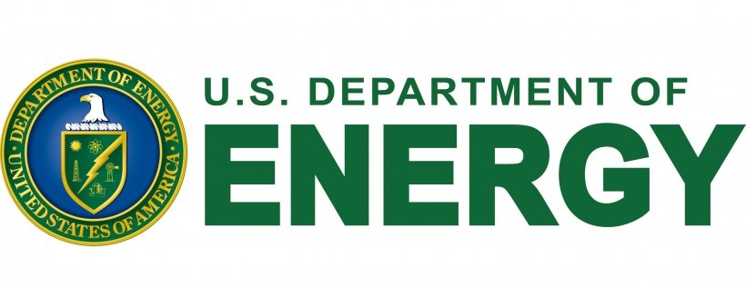

<h1 align="center">
    
</h1>

<h6>Project brief</h6>
For the Maven Power Outage Challenge, you'll be playing the role of a Senior Analytics Consultant hired by the U.S. Department of Energy (DOE). Here's your project brief:
 
 
Electricity outages are a growing concern as we enter an age of unprecedented energy demand and climate disasters.

We have event-level power outage data going back to 2002 but have struggled to make sense of it due to severe issues with the data quality and integrity.

This is where you come in.

We need you to consolidate and clean up the raw data, and create a dashboard or report to help us understand patterns and trends around outages, quantify their impact on our communities, and identify possible weak points in the grid.

Last but not least, please explicitly call out any caveats or assumptions you make in regard to data quality issues or missing values.

### Data Cleaning
Data Dictionary is used as a guide for expected values.

Data Dictionary

 
**Field	Description:**
*  **Date & Time Event Began:**	The month day year and time (in 24-hour format) when the incident began.
*  **Date & Time of Restoration:** The month day year and time (in 24-hour format) when the event no longer met one of the 24 criteria for an emergency alert.
*  **Area Affected:** The name of the State(s) and political subdivision(s) (i.e. city town county etc.) affected by the incident. This represents the largest area affected by the incident and it's not a requirement to list all the cities and towns in a region or State.
*  **NERC Region:** The North American Electric Reliability Corporation (NERC) region responsible for the restoration
*  **Alert Criteria:**	Emergency criteria met that caused the form to be filled
*  **Event Type:** Cause of the incident
*  **Demand Loss (megawatts):** The amount of the peak demand involved over the entire incident. If the amount is unknown and you are unable to make an estimate then leave this blank.
*  **Number of Customers Affected:**	The total number of customers affected during the entire incident or disturbance which could be more than the peak number in the case of rolling blackouts. If this number cannot be estimated when the form is initially submitted check the unknown box.

**Additional Note:**

* The year range is from 2002 to 2023.
* Users are instructed to leave blank when unable to estimate outages MW or population. For analysis purposes these numbers will be estimated. 

Stage One

 

**Excel**
* Used the Data Dictionary as a guide for expected values.
* Formatted data tables:
    * Format to use 2022's column names as this format best fits the majority of the data.
    * For Alert criteria before 2015, list as 'unknown'.
    * Split combined date time columns for years before 2011.
    * Formatted the correct type for date, time, and integer columns.
* Dates transposed (showing as finishing before the start date), corrected the date and month then moved to the correct sheet when appropriate.
* Removed 'ongoing' from the date column.
* Remove gridlines and white background color.
* Sheet 2023: Removed Temp column.
* Sheet 2016: Only had data up to October 31st.
* Sheet 2011: the years 2077 (well into the future) and 2001 (before data collection) were corrected to 2011 to match the start date.
* Sheet 2004: Removed record with no start and end dates. Unable to confirm actuals.
* Sheet 2002 and 2003: Merge and center data cells by date across all columns where appropriate.

Stage Two

 

**Excel**
* Combined into a single sheet. Shape (3913,11).
* Merge any identified duplicates.
* Alert Criteria: Fill blank with 'Unknown'.
* Format data to Calibri 10 middle center.
* Format date formula: `=DATE(YEAR(C2),MONTH(C2),DAY(C2))`
* Format time to resolve a.m./p.m. issue: `=SUBSTITUTE(SUBSTITUTE(TEXT(C2, "hh:mm AM/PM"), "a.m.", "AM"), "p.m.", "PM")`
* Convert to time: `=TIME(HOUR(D2),MINUTE(D2),SECOND(D2))`
* Merge date time: `=DATE(YEAR(B2), MONTH(B2), DAY(B2)) + TIME(HOUR(C2), MINUTE(C2), SECOND(C2))`
* Convert restoration time based on hours: `=B2 + TIME(7, 0, 0)`
    * Dates are adjusted for times that rollover.
* Date Event Began: 
    * Format to date type, correct transposed dates i.e. ends before it starts.
    * Combined date and time as "Date Event Began".
* Time Event Began: Removed extra spaces and words, transitioned to time ##:## AM/PM format, Changed 5:70 to 5:00, N/A and blank changed to 1600 as this is the most common time per [Red Cross.](https://perryco.org/wp-content/uploads/2020/07/poweroutage.pdf)
* Date of Restoration: 
    * Ongoing and blank dates are filled with the start dates as that is the only day we can confirm the outage occurred. 
    * Formatted to date type.
* Time of Restoration: 
    * Removed extra spaces and words, 
    * Transitioned to time ##:## AM/PM format, N/A and blank end times determined by average time per year based on reporting from [US Energy Information Administration.](https://www.eia.gov/todayinenergy/detail.php?id=54639#:~:text=When%20major%20events%E2%80%94including%20snowstorms,year%20from%202013%20to%202021.) 
    * No reliable date before 2008, used an average time of 3.5 hours for 2009 and all earlier years. [Eaton Blackout Tracker](https://www.eaton.com/content/dam/eaton/products/backup-power-ups-surge-it-power-distribution/backup-power-ups/blackout-tracker-/eaton-blackout-tracker-annual-report-2009.pdf) began in early 2008 but only the 2009 report is available. 
    * No reliable date after 2021, used an average time of 7 hours in 2021 for all later years.
    * Combined date and time as "Time of Restoration".
* Area Affected: Puerto Rico: to Puerto Rico, blank to Unkown
* NERC Region: Puerto Rico areas changed to PR [they do not fall into a specific region](https://19january2017snapshot.epa.gov/energy/north-american-reliability-corporation-nerc-region-representational-map_.html). Filled blanks by looking at similar Area Affected.
 
* Event Type: 
**Note 1:** Format so that similar items are grouped for analysis. Many nuanced details fail to provide additional insight and hinder analysis often due to the low number of records. Grouping related instances will allow better general analysis and is more appropriate for a dashboard.
**Note 2:** Public appeals are a request for public energy conservation and not a cause. It is done when the power grid is unable to supply the power needed; Generation Inadequacy.
    * Format as Text.
    1. Cyber Event: All cyber attacks/events and telecommunication attacks. Excludes computer hardware.
    1. Equipment Failure: All variants of equipment/line/generator/switch/hardware/cable/substation/exciter/breaker faulted/failure/malfunction/tripped/error/loss/shutdown, complete system failure, Operational Failure of Electrical System. Unless the cause is listed i.e. fire, severe weather, etc., we only know the equipment failed.
    1. Fire/Wildfire: All variations of fire listed, all variants of wildfire and Brushfire (a type of wildfire); supersede equipment failure.
    1. Generation Inadequacy Load/Fuel/Supply: Generation inadequacy, inadequate electric resources to serve load, pubic appeals, high loads, all to Fuel Supply Deficiency, loss of power from wholesaler, CAISO Initiated Interruption: All [CAISO (California Independent System Operator)](https://www.caiso.com/Documents/Rotating-Power-Outages-Fact-Sheet.pdf) variants converted. Unless the cause is listed i.e. fire, severe weather
    1. Natural Disasters - Earthquake/Hurricane/Tornado/Tropical: All variants of hurricanes, tornados, and tropical depressions.
        * Natural disasters could encompass more than listed here depending on the source definition. A decision was made to group other weather events separately as it is likely unique decisions can be made for them.
    1. Other: Rare and unique events. Low-flying helicopter, Voltage Reduction (System Test), Made Public Appeal - System Drill, and other.
    1. Physical Attack/Vandalism: all variants of physical attack, vandalism, and suspicious activity.
    1. Severe Weather - Heat Wave: Heat storm, heat wave, high temperatures.
    1. Severe Weather - Lightning/Thunderstorm: Lightning storms, lightning strikes, lighting, thunderstorms and [Hail](https://www.nssl.noaa.gov/education/svrwx101/hail/).
    1. Severe Weather - Rain/Wind/Flooding: All variants of rain, flooding, with or without Wind.
    1. Severe Weather - Wind: Nor'easter, high winds, Severe Storm with High Wind Gusts, dust storm.
    1. Severe Weather - Winter/Snow/Ice: All variants of winter, snow, ice, cold weather, freezing rain and winter storm events. NOAA's National Severe Storms Laboratory [groups these as winter storms.](https://www.nssl.noaa.gov/education/svrwx101/winter/types/#:~:text=Winter%20Storms&text=While%20heavy%20snowfalls%20and%20severe,of%20ice%20on%20exposed%20surfaces.), Public Appeal due to Severe Weather - Cold.
    1. Severe Weather - Unspecified/Other: May or may not include high winds, severe weather, severe/major storms, weather, fog.
    1. System Operations: [System operations](https://www.pjm.com/markets-and-operations/ops-analysis), operational failure of electrical system.
    1. Unkown/Unspecified: Unknown *, - Unknown, Distribution Interruption - Unknown Cause, [Load shedding](https://www.techtarget.com/searchdatacenter/definition/load-shedding), shed firm load, public appeal (no cause listed), load reduction, interruption of firm power, Electrical System Separation/[Islanding](https://en.wikipedia.org/wiki/Islanding). Unless the cause is listed i.e. fire, severe weather, etc.

 

* NERC Region
    * Electricity Information Sharing and Analysis Center (E-ISAC) converted to the appropriate NERC region based on the criteria listed below:
        * [NERC Atlas for NERC identification](https://atlas.eia.gov/datasets/eia::nerc-regions/explore?location=28.054751%2C-86.957928%2C4.65) with Google Maps to identify locations not in the atlas.
        * NERC based on the Area Affected Column. 
        * Convert delimiters to ",".
        * Corrected spellings.
        * Purto Rico: PR
        * Hawaii: HI
        * Indeterminate NERC membership: List nearest NERC.
 

* Demand Loss(MW): 
    * The expected value is a number or leave blank if unknown. All strings were removed.
    * Deleted: 'NA', 'unknown', '-', descriptive text.
    * For ranges, only accept the highest estimate.
    * Approx, greater/Less than converted to just the number given.
    * customers affected moved to the correct column, deleted peak and kept actual (and removed strings). 
    * Removed dates and times.
    * Error: Number stored as text, converted to a number.
    * Formated number with one decimal place to maintain the accuracy of estimates given.
    * Filled blanks where specified in Alert Criteria, accepting the highest if a range is given.
        * In the case of "Uncontrolled loss of (various numbers provided) Megawatts or more...", blanks filled in as 100.

 

* Number of Customers: 
    * The expected value is a number or left blank if unknown. 
    * Deleted descriptive text.
    * Error: Number stored as text, converted to a number.
    * Deleted: 'NA' and 'unknown' strings, date, '-'.
    * Approx, greater/Less than converted to just the number given.
    * Converted utilities and industrial to just the number given.
    * Formatted to a whole number.
    * Fill in blanks where specified in Alert Criteria, accepting the highest if a range is given.
        * in the case of "Loss of electric service to more than 50,000 customers...", blanks filled in as 50000.
    * In some instances, the number reported may be less than suggested in the Alert Criteria. No correction was made. 

Stage Three

  
<b>Python</b>

* Identify negative datetimes
     * For datetime correction: in the case of 00:00 to early morning, (0400) it is considered a wrong day issue as it is common for Americans to transition to the AM as if it is the same day in common talk. This is further supported by the times often starting in late evening or near midnight. 
    * In all other cases, the dates will be treated as if they are transposed and swapped accordingly. 
* Fill in blanks based on Event Type and NERC Region averages.
    * Fill remaining after by just Event Type.
* Identify US states and Canadian provinces.
* Identify duplicate dates, and export list to Excel for manual comparison to confirm if merge is neccessary.
* Column names to all upper case.
* Save as 'DOE_final.xlxs'.

<b>Excel</b>
* Validate and complete state and province identification. 
* Duplicates are identified by Reporting Area and similarity of time, then merged. 
    * If the same reporting areas the highest number is kept. If one has additional reporting then numbers are combined.
    * Different Area Affected in the same state, the same Event Type, and with the same cause and the same start and end times will be combined.
    * Combined special cases:
        * 2007-9-18 5:15 and 9-18 5:14 events.
        * 2010-6-17 0930, all 3 keep the latest resolution reporting.
* Correct NERC Region based on state identification.
* Manually correct states post Python processing.
* Google city, area, and county locations. 
* Unknown locations left blank, 18 total.
* Carolina = ['North Carolina','South Carolina']
* [Midcontinent Independent Operator (MISO)](https://ca.practicallaw.thomsonreuters.com/w-016-8616?transitionType=Default&contextData=(sc.Default)&firstPage=true#:~:text=One%20of%20seven%20regional%20transmission,%2C%20Indiana%2C%20Iowa%2C%20Kentucky%2C).
* [Delmarva Power service territory](https://www.delmarva.com/AboutUs/Pages/CompanyInformation.aspx#:~:text=Delmarva%20Power%2C%20a%20public%20utility,gas%20customers%20in%20northern%20Delaware.)
* [Southwestern Region of Service Territory](https://www.swepco.com/company/about/#:~:text=SWEPCO%20Fact%20Sheet-,Service%20Territory,Panhandle%20area%20of%20North%20Texas.)
* [Mid-Altantic Region of PJM](https://www.pjm.com/about-pjm/who-we-are.aspx#:~:text=PJM%20Interconnection%20is%20a%20regional,and%20the%20District%20of%20Columbia.)
* [Duke Energy](https://www.duke-energy.com/partner-with-us/economic-development/the-carolinas)
* [Dominion Energy](https://en.wikipedia.org/wiki/Dominion_Energy#:~:text=Dominion%20Energy%2C%20Inc.%2C%20commonly,Ohio%2C%20Pennsylvania%2C%20North%20Carolina%2C)
* [ComEd](https://www.exeloncorp.com/companies/comed#:~:text=ComEd's%20service%20territory%20comprises%20the,south%20(roughly%20Interstate%2080).)
* [BGE](https://www.bge.com/AboutUs/Pages/CompanyInformation.aspx)
* [A.D. Edmonston Pumping Plant](https://www.watereducation.org/aquapedia/ad-edmonston-pumping-plant)
* [CSWS-AEP West](https://www.aep.com/about/businesses/opcos#:~:text=Maintaining%20the%20nation's%20largest%20electricity,Texas%2C%20Virginia%20and%20West%20Virginia.)
* [Southern Company](https://www.southerncompany.com/about/our-business/energyisessential.html#:~:text=Our%20family%20of%20companies%20is,in%20Georgia%2C%20Alabama%20and%20Mississippi.)
* [Entergy System](https://www.entergy.com/about/)
* [TVA Service Territory](https://www.enelx.com/n-a/en/resources/brochures/tennessee-valley-authority-demand-response)
    * [Government archives](https://www.archives.gov/milestone-documents/tennessee-valley-authority-act#:~:text=As%20a%20federal%20public%20power,%2C%20North%20Carolina%2C%20and%20Georgia.)
* [Balancing Area](https://www.eia.gov/electricity/gridmonitor/about)
    * [Southeastern Power Administration (SEPA)](https://www.federalregister.gov/agencies/southeastern-power-administration#:~:text=The%20Southeastern%20Power%20Administration%20is,Mississippi%2C%20Tennessee%2C%20and%20Kentucky.)

 
 
 
 
Version 11/21/2023
 
 

Github Structure

  
<b>Python</b>

├── LICENSE
├── README.md          <- The top-level README for developers using this project.
├── data
│   ├── processed      <- The final, canonical data sets for modeling.
│   └── raw            <- The original, immutable data dump.
│
├── docs               <- A default Sphinx project; see sphinx-doc.org for details
│
├── models             <- Trained and serialized models, model predictions, or model summaries.
│
├── notebooks          <- Jupyter notebooks.
│
├── references         <- Data dictionaries, manuals, and all other explanatory materials.
│
├── reports            <- Generated analysis as HTML, PDF, LaTeX, etc.
│   └── figures        <- Generated graphics and figures to be used in reporting
│
├── requirements.txt   <- The requirements file for reproducing the analysis environment,
│                         generated with `pip freeze > requirements.txt`
│
├── setup.py           <- makes project pip installable (pip install -e .) so src can be imported
├── src                <- Source code for use in this project.
│   ├── __init__.py    <- Makes src a Python module
│   │
│   ├── data           <- Scripts to download or generate data
│   │   └── make_dataset.py
│   │
│   ├── features       <- Scripts to turn raw data into features for modeling
│   │   └── build_features.py
│   │
│   ├── models         <- Scripts to train models and then use trained models to make
│   │   │                 predictions
│   │   ├── predict_model.py
│   │   └── train_model.py
│   │
│   └── visualization  <- Scripts to create exploratory and results-oriented visualizations

